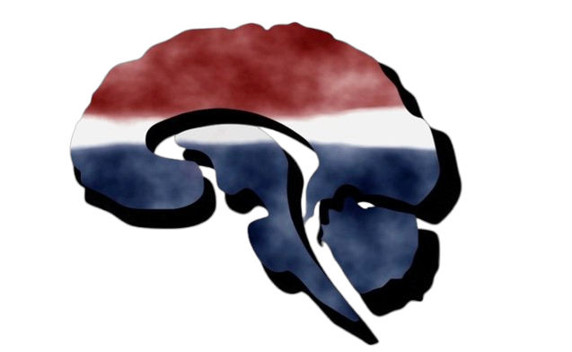

# Penn Grey Matters

<div align="center">
  
</div>

[](https://nextjs.org/)
[](https://react.dev/)
[](https://www.typescriptlang.org/)
[](https://tailwindcss.com/)
[](https://docs.pmnd.rs/react-three-fiber)
[](https://www.sanity.io/)
[](https://www.framer.com/motion/)

> **Official website** for [Penn Grey Matters](https://greymattersjournalpenn.org) — a student neuroscience publication at the University of Pennsylvania dedicated to making neuroscience accessible through articles, podcasts, and interactive experiences.

---

## Project Overview

This repository is the flagship website for **Penn Grey Matters**, a neuroscience publication run by students at the University of Pennsylvania. It is not a blog; it is a scroll-driven, cinematic, scientifically-grounded digital publication built to serve as a reference for university science media.

**Site structure — three pillars:**

| Pillar | Purpose |
|--------|---------|
| **Publication** | Articles, Grey Frequencies podcast, archive |
| **Exploration** | Grey Matter — interactive 3D brain explorer |
| **Community** | Chapters worldwide, team, get involved |

**Navigation:** Home | Articles | Grey Matter | Podcast | Research | Chapters | About | Join

---

## Grey Matter — Interactive Brain Explorer

The `/explore` route hosts **Grey Matter**, an interactive 3D brain visualization built with Three.js and React Three Fiber. Users can orbit, zoom, and pan around a neuroanatomically-informed brain model. Brain regions (hippocampus, amygdala, prefrontal cortex, etc.) are linked to functions, conditions, and related articles from the publication.

- **3D Engine:** Three.js via React Three Fiber and Drei
- **Data:** Region metadata, pathways, and article links in `data/brain-regions.json` and `data/brain-pathways.json`
- **Model:** GLTF brain asset in `public/models/brain/`

---

## Tech Stack

### Frontend

- **Framework:** [Next.js 15](https://nextjs.org/) (App Router, Turbopack)
- **Language:** TypeScript 5
- **Styling:** Tailwind CSS v4
- **Motion:** Framer Motion 11 — preloader, hero transitions, scroll-driven animations
- **Carousel:** Embla Carousel React
- **State:** Zustand

### Interactive 3D

- **Engine:** Three.js via [React Three Fiber](https://docs.pmnd.rs/react-three-fiber)
- **Helpers:** [@react-three/drei](https://github.com/pmndrs/drei) — OrbitControls, useGLTF

### Backend & CMS

- **CMS:** Sanity v3 (schema in `sanity/schema.ts`; Studio setup pending)
- **API Routes:** Contact form (`/api/contact`), newsletter (`/api/newsletter`) via Resend

---

## Local Development

1. **Clone the repository**
   ```bash
   git clone https://github.com/tmarhguy/greymattersupenn.git
   cd greymattersupenn
   ```

2. **Install dependencies**
   ```bash
   npm install
   ```

3. **Run the development server**
   ```bash
   npm run dev
   ```
   Open [http://localhost:3000](http://localhost:3000).

---

## Project Structure

| Path | Description |
|------|--------------|
| `app/` | Next.js App Router pages and layouts |
| `components/` | Hero, Navigation, Preloader, Articles, BrainCanvas, Footer, etc. |
| `data/` | Static JSON — brain-regions, brain-pathways, chapters, articles, team |
| `lib/` | Sanity client, utilities |
| `sanity/` | Sanity schema definitions (article, episode, teamMember, chapter) |
| `public/` | Images, 3D models, main logo |

---

## Environment Variables

Create `.env.local` and configure:

| Variable | Purpose |
|----------|---------|
| `SANITY_PROJECT_ID` / `NEXT_PUBLIC_SANITY_PROJECT_ID` | Sanity CMS project |
| `RESEND_API_KEY` | Contact form and newsletter (Resend) |
| `EDITORIAL_EMAIL` | Contact form submission recipient |

---

## Key Routes

| Route | Description |
|-------|-------------|
| `/` | Homepage — preloader, hero, scroll story |
| `/articles` | Article archive |
| `/articles/[slug]` | Article detail with related articles carousel |
| `/explore` | Grey Matter — interactive brain |
| `/podcast` | Grey Frequencies podcast |
| `/research` | Research spotlight |
| `/visualizations` | Neuron diagrams, brain scans, illustrations |
| `/chapters` | Grey Matters chapters worldwide |
| `/about` | Purpose, scope, commitment |
| `/team` | Editorial team |
| `/get-involved` | Join form |
| `/contact` | Contact form |

---

## Content Migration

Content from the legacy site (`old-website-data/`) — Purpose, Scope, Commitment, Articles, Chapters, Team — is intended for manual entry into Sanity. See [docs/ARTICLE-MIGRATION.md](docs/ARTICLE-MIGRATION.md) for the article inventory and migration steps.

---

## Related

- **Legacy site:** [greymattersjournalpenn.org](https://greymattersjournalpenn.org)
- **Article migration:** [docs/ARTICLE-MIGRATION.md](docs/ARTICLE-MIGRATION.md)

---

**Penn Grey Matters** — University of Pennsylvania | Making Neuroscience Accessible
